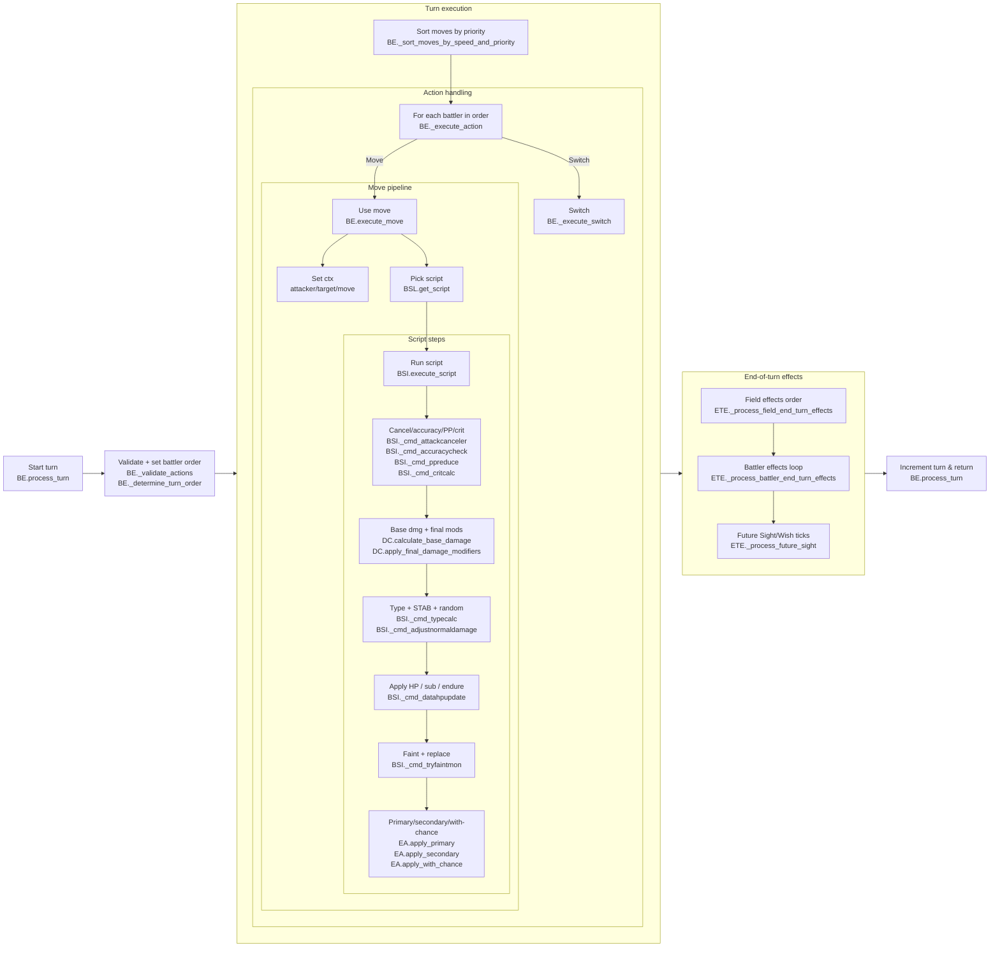

### Battle Engine High-Level Flow

Key:
- BE: BattleEngine
- BSI: BattleScriptInterpreter
- BSL: BattleScriptLibrary
- DC: DamageCalculator
- EOT: EndTurnEffectsProcessor
- BS: BattleState
- EA: effect_applier
- ME: move_effects
- TE: TypeEffectiveness
- ETE: end_turn_effects